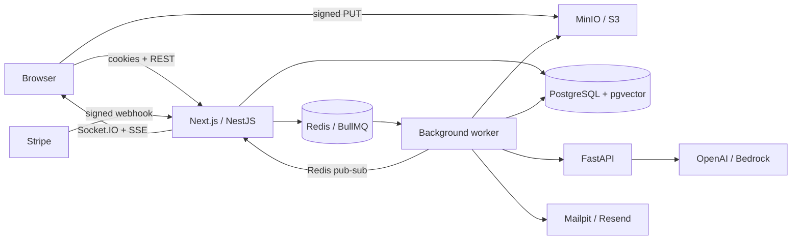

# Trackr

**Your job search, thoughtfully organized.** A full-stack job application tracker with a Kanban board, PDF CV parsing, AI match analysis, streaming cover letters, interview preparation, reminders, and subscription billing.

Built as a learning and portfolio project with Next.js, NestJS, PostgreSQL/pgvector, Redis/BullMQ, and FastAPI.

## Run locally

Prerequisites: Node.js 22.20+ (24 LTS recommended), pnpm 11.19, Docker Desktop with a working Linux engine, Python 3.12, and uv. Copy `.env.example` to `.env` first. Development credentials in that example are for your local machine only.

```sh
pnpm install
docker compose up -d && pnpm db:migrate && pnpm db:seed
pnpm dev
```

In a second terminal, start the AI service:

```sh
cd services/ai
uv sync --frozen
uv run uvicorn app.main:app --reload --port 8000
```

Open [Trackr](http://localhost:3000). The demo account is **demo@trackr.dev / Demo1234!** after seeding. Its six opportunities are explicitly illustrative examples, not actual job listings. To seed an administrator, set `SEED_ADMIN_PASSWORD` to a password of at least 12 characters and run `pnpm db:seed` again. No administrator password is hard-coded.

AI generation needs `OPENAI_API_KEY` or configured Bedrock credentials. Google OAuth, Stripe, Resend, Sentry, and OpenTelemetry are optional integrations, activated through `.env`. AI actions never return fabricated successful results when a provider is unavailable. Mailpit captures development emails locally.

### Entire stack in containers

```sh
docker compose --profile apps up --build -d
docker compose --profile apps run --rm migrate pnpm db:seed
```

The default Compose command starts only infrastructure so you can develop the applications on your host. The `apps` profile also starts web, API, worker, AI, and the migration task, with source bind mounts for hot reload.

| Service                   | URL                                    |
| ------------------------- | -------------------------------------- |
| Web                       | http://localhost:3000                  |
| API / OpenAPI             | http://localhost:4000/api/docs         |
| Health                    | http://localhost:4000/api/health       |
| AI docs, local only       | http://localhost:8000/docs             |
| MinIO console             | http://localhost:9001                  |
| Mailpit inbox             | http://localhost:8025                  |
| Queue monitor, admin only | http://localhost:4000/api/admin/queues |

## What is implemented

- Email registration/login, Argon2 hashes, Passport JWT cookies, rotating hashed refresh tokens, logout, Google OAuth with state checking and verified email.
- A responsive light/dark workspace: dashboard, saved-job search/sort/pagination, job forms, drag-and-drop board, notes, stage selection, and CV selection.
- Ownership checks on jobs, applications, CVs, reminders, notifications, and AI results; role-protected admin endpoints and UI.
- Signed, create-only PDF uploads, 5 MB limit, file-signature verification, private S3-compatible storage, background extraction, structured CV parsing, and embeddings.
- Provider interface for OpenAI and AWS Bedrock; validated outputs with one retry; pgvector-assisted match analysis; streamed cover letters; interview questions.
- Durable pending AI records, transactional quota reservation, retrying background jobs, live Socket.IO notifications, and SSE streaming.
- Welcome/reminder/weekly-summary React Email templates; local SMTP and production Resend. Weekly summaries run Mondays at 08:00 UTC.
- Stripe Checkout/Portal, verified raw-body webhooks, idempotent event handling, latest-state subscription reconciliation, and 10/200 monthly AI quotas.
- Admin user search, usage totals, signup chart, and MRR for the configured single monthly Stripe price.
- Security headers, Redis-backed rate limiting, origin checks, CSRF double-submit cookies, structured logging, and optional monitoring/tracing.
- Dev/production Docker, Caddy, CI/image publishing, SSH deployment, backup script, and an AWS Terraform reference deployment.

Live accounts and infrastructure must still be configured before these integrations can be exercised outside tests. See [validation status](docs/VALIDATION.md), [setup](docs/setup.md), and [deployment](docs/deploy.md).

## Architecture



`apps/web` is the frontend; `apps/api` contains the REST server and a separate worker entry point. `services/ai` isolates Python AI code. `packages/shared` provides validation and types used by both TypeScript apps, while `packages/config` holds common compiler/lint/format settings. Infrastructure and operational instructions live in `infra` and `docs`.

## Commands and checks

```sh
pnpm dev                 # web + API + worker
pnpm build               # production builds
pnpm lint
pnpm typecheck
pnpm test                # unit and DB-backed API integration tests
pnpm test:e2e            # browser UI tests; live journey is opt-in
pnpm db:generate
pnpm db:migrate
pnpm db:seed
pnpm format
```

The API tests use isolated PGlite with pgvector when `TEST_DATABASE_URL` is absent. Set that variable to a **disposable PostgreSQL test database** to exercise PostgreSQL 16 instead; CI does this. Queue, object-storage and paid provider calls are replaced in tests. No test calls a paid AI API.

For the complete live browser journey, start the normal stack, install Playwright with `pnpm --filter @trackr/web exec playwright install chromium`, then run `E2E_LIVE=1 pnpm test:e2e` (PowerShell: `$env:E2E_LIVE='1'; pnpm test:e2e`). The test creates a unique test account and application. Browser UI tests use explicit fixtures for additional desktop/mobile layout checks; fixture-based checks do not prove external integrations work.

Python: `cd services/ai && uv run pytest && uv run ruff check app tests`.

## Learn and ship

- [Technical stack and compatibility notes](docs/TECH_STACK.md)
- [Architecture and security decisions](docs/architecture.md)
- [Provider setup and troubleshooting](docs/setup.md)
- [VPS deployment and rollback](docs/deploy.md)
- [AWS Terraform setup](infra/terraform/README.md)
- [Learning journal template](docs/LEARNING.md) — intentionally left for the human author.

No public deployment URL is claimed. Add a live demo URL and replace the screenshot placeholders below after deployment and final integration verification.

**Screenshots:** dashboard desktop, mobile dashboard, application board, and CV-to-match flow. Playwright produces local screenshots in `apps/web/test-results/`.
