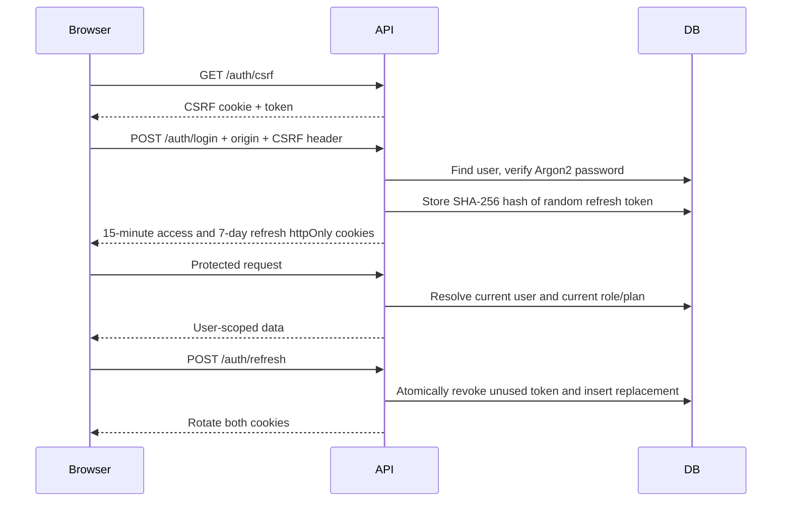
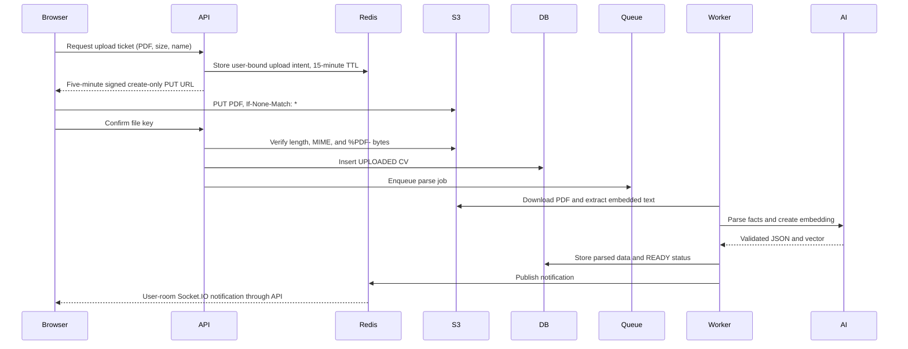
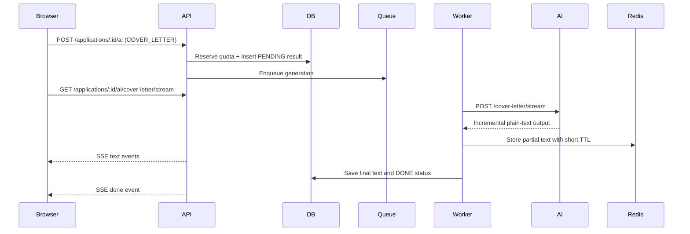

# Architecture and operational decisions

## Trust boundaries

The browser communicates with the Nest API using httpOnly access/refresh cookies and a double-submit CSRF token. Browser forms and API inputs use shared Zod schemas. The API is the authority for identity, roles, ownership, billing state, and usage limits. The Next proxy checks only cookie presence to improve navigation; it is not an authorization boundary.

PostgreSQL owns durable application state. Redis holds job queues, pub/sub, rate counters, short-lived upload tickets, and streamed partial text. S3-compatible storage holds private PDF files. FastAPI is internal and requires a constant-time checked `X-Internal-Key` for AI endpoints. It has no direct database access.

## Login and rotation



Refresh tokens cannot be replayed after rotation. Access JWTs expire after 15 minutes; logout clears the browser's cookies and revokes its refresh token. Already-copied access JWTs remain valid until expiry. Separate tabs may race to refresh; within one tab the API client coalesces refresh requests. Full session-family replay revocation and cross-tab coordination are future hardening opportunities.

Google uses an authorization-code exchange with a short-lived random state cookie and a verified email claim. An existing password account with the same email is not silently linked.

## CV upload and processing



Create-only uploads prevent replacing a verified object through a reused URL. A private user-prefixed key and upload ticket prevent cross-account confirmation. There is no OCR or malware scanning in this portfolio implementation. Put lifecycle cleanup and malware scanning in front of production processing if needed. PDF parsing is isolated in the worker container with memory limits.

## Board transactions and quotas

Moving a card locks the current user's database row, reads that user's board, inserts the card at its destination, and reindexes affected columns within one transaction. The frontend makes an optimistic change and restores the previous cache if the request fails. Status selection in the drawer provides a keyboard/touch alternative to dragging.

AI admission locks the same user row, reads the latest subscription plan, checks the monthly quota, increments usage, and inserts a PENDING result atomically. This prevents concurrent requests from overspending the quota. PENDING result records act as a durable outbox, recovered by the worker's five-minute sweep if enqueueing fails. Each accepted task uses one credit, including a task whose provider ultimately fails. CV parsing and job embeddings are not charged against the per-application credit quota.

## Cover-letter streaming



The streaming GET has no billing or generation side effect. Reconnecting does not consume a credit. The UI polls saved AI result status as a fallback when a live event is lost. SSE connections close after three minutes; completed results remain accessible in PostgreSQL.

## Stripe webhook

```mermaid
sequenceDiagram
  Stripe->>API: Signed raw-body event
  API->>API: Verify timestamp and signature
  API->>DB: Begin transaction; lock customer user
  API->>DB: Claim unique Stripe event ID
  API->>Stripe: Read current customer subscriptions
  API->>DB: Update subscription and FREE/PRO plan
  API-->>Stripe: Acknowledge
```

Duplicate events become no-ops. A failed transaction rolls back the event claim, allowing retry. Reading current Stripe state while holding a customer lock protects against out-of-order events. The admin MRR assumes the configured single monthly price, without discounts, taxes, currency conversions, or proration. It is a product metric, not accounting revenue.

## Delivery and idempotency

Jobs retry three times with exponential backoff and stable IDs. Successful work is checked before repeating. Notification event keys deduplicate insertions. Email jobs use stable Resend idempotency keys and a Redis sent marker; reminders also record `sent_at`.

SMTP does not offer an atomic transaction with PostgreSQL/Redis. A process crash after SMTP accepts mail but before the sent marker is written can produce a duplicate on retry. Resend's idempotency window improves this but is not an unlimited exactly-once guarantee. Do not claim exactly-once external email delivery. A production email outbox and provider reconciliation can strengthen this behavior.

## Security checklist

- User-scoped ownership checks and foreign-key ownership validation on relationship changes.
- Argon2 passwords; short-lived JWTs; hashed rotating refresh tokens; secure cookies in production.
- Mutation origin checks and constant-time double-submit CSRF validation, including login and refresh. Stripe webhooks instead require Stripe signatures.
- Atomic Redis rate limits (40 auth/AI route requests, 300 other requests per IP per minute).
- Zod/Pydantic validation, SQL parameterization, UUID pipes, safe error responses, no arbitrary sort expressions.
- Signed private uploads, bounded input size, create-only PUT, PDF signature verification, no HTML interpretation of notes or AI output.
- Prompts treat CV/job text as untrusted input. Structured LLM outputs are validated, with one retry on invalid JSON. Scores are preparation guidance rather than hiring guarantees.
- Helmet/CSP, no frame embedding, guarded queue monitor, no public AI/database/Redis ports in production.
- Request IDs and sensitive-header redaction; optional Sentry and distributed tracing.
- Non-root application containers; bounded resources, private infrastructure, remote encrypted Terraform state, no committed credentials.

Remaining production hardening includes account recovery/verification, abuse limits on expensive CV parsing and embeddings, robust malware scanning, tenant data retention, backup restore drills, broader load/race testing, stronger CSP nonces, complete telemetry validation against live collectors, and dependency/security auditing. Review these against the actual deployment's needs.
